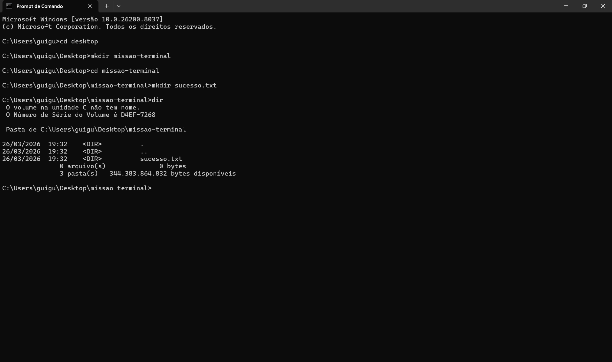

# una-ihcux-lista01

# ⚡ Meus Comandos Usados Nesse Projeto
Aqui estão os comandos que mais utilizei na aula de Terminal:

- `cd`: Para navegar entre pastas.
- `dir`: Para listar arquivos.
- `mkdir`: Para criar arquvios.

## 📸 Evidência de Execução

